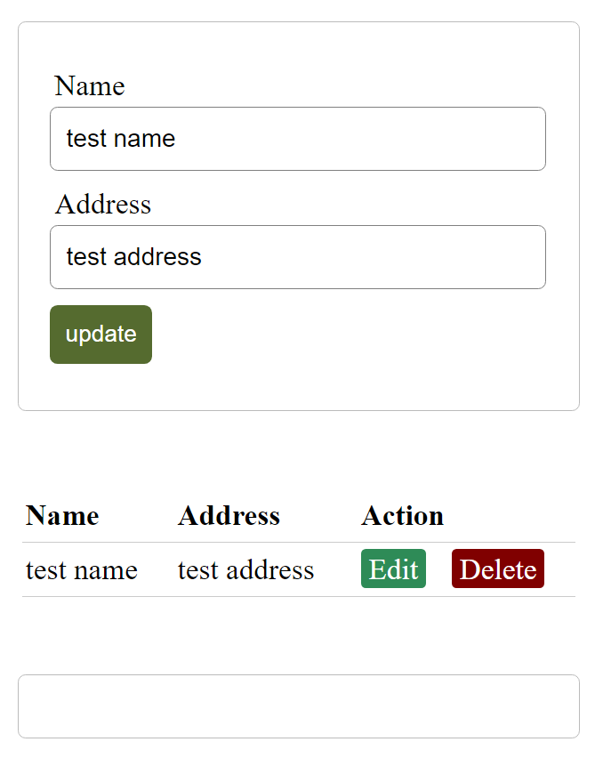

Simple PHP CRUD application. Create, edit, update and delete posts with MySQL database

> Inspired by this article 
> [PHP CRUD Create, edit, update and delete posts with MySQL database](https://codewithawa.com/posts/php-crud-create,-edit,-update-and-delete-posts-with-mysql-database)



What i need to do, to deploy this application?

# Install this application in Docker containers locally

## 1. Install Docker, MySQL client. Create Mysql Database in container.

```console
apt update
apt install -y docker.io docker-buildx

docker run --name mysql -e MYSQL_DATABASE=crud \
                        -e MYSQL_USER=user \
                        -e MYSQL_PASSWORD=userpass \
                        -e MYSQL_ROOT_PASSWORD=rootpass \
                        -d -p 3306:3306 \
                        -v sqldata:/var/lib/mysql \
                        docker.io/library/mysql:latest

ls ./sqldata
docker ps 
docker logs -f mysql
```

You can access mysql database from outside container if you published mysql container with `-p 3306:3306` and install mysql client locally

```console
apt update && apt install -y mysql-client-core-8.0 php-mysql
mysql -h127.0.0.1 -uuser -puserpass crud

```

## 3. Create CRUD PHP application from Dockerfile

CRUD application get mysql server name, user name and password from variables

- MYSQL_SERVER: MYSQL server name
- MYSQL_USER: MySQL username
- MYSQL_PASSWORD: MYSQL password
- MYSQL_DATABASE: MYSQL database name

```console 
docker buildx build --no-cache -t crud-app crud-app/
docker image ls
docker run -d --link mysql \
              --name crud-app \
              -p 8080:80 \
              -e MYSQL_SERVER=mysql \
              -e MYSQL_USER=user \
              -e MYSQL_PASSWORD=userpass \
              -e MYSQL_DATABASE=crud crud-app
```

We do not need to create table `info` in MySQL database `crud`.
Application will create all that it will need on first launch.

## 4 Access to application locally with Internet Browser

```
firefox http://localhost:8080
```

## 5 To stop and delete all containers with all data 

```console
docker stop `docker ps -a -q`
docker rm `docker ps -a -q`
docker volume rm sqldata
```

# Install this application in with docker-compose

```console
apt update
apt install -y podman.io docker-compose docker-buildx
cd docker-compose
docker-compose up -d
```

Now you cat test it with `firefox http://localhost:8080`

# Deploy application to kubernetes cluster with kubectl only commands


```console
kubectl create secret generic mysql --from-literal database=crud --from-literal user=user --from-literal password=pass --from-literal root-password=rootpass --from-literal server=mysql

kubectl create service clusterip mysql --tcp=3306:3306

kubectl create deployment mysql --image docker.io/library/mysql:latest --dry-run=client -o yaml > mysql-deployment.yaml
kubectl set env deployment mysql --from secret/mysql --prefix MYSQL_

kubectl create deployment crud-app --image dmi3mis/crud-app:latest
kubectl set env deployment crud-app --from secret/mysql --prefix MYSQL_
kubectl scale deployment crud-app --replicas 4

kubectl port-forward  service/crud-app 8080:80

firefox http://localhost:8080
```

# Deploy application tyo kubernetes with yaml manifests and kustomize

```console
git clone https://github.com/dmi3mis/crud-php-mysql/

cd crud-php-mysql
cd Kubernetes/crud-app/overlay/dev

kubectl apply -k .
kubectl get all --namespace dev

cd ../prod

kubectl apply -k .
kubectl get all --namespace dev
```
